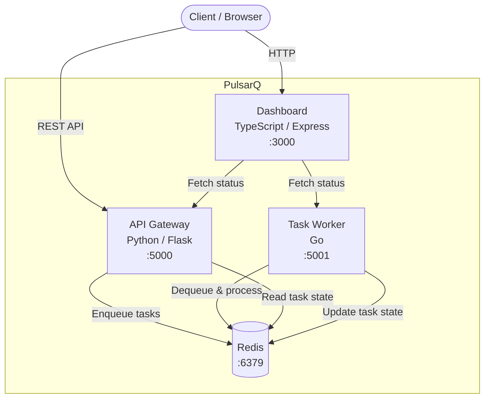

# PulsarQ

A microservices-based task queue and event processing platform with a real-time monitoring dashboard.

PulsarQ lets you submit, queue, process, and monitor background tasks through a simple REST API, a high-performance Go worker, and a live web dashboard.

## Architecture



## Services

| Service | Language | Port | Description |
|---------|----------|------|-------------|
| **api-gateway** | Python (Flask) | 5000 | REST API for task CRUD and queue management |
| **task-worker** | Go | 5001 | Dequeues and processes tasks from Redis |
| **dashboard** | TypeScript (Express) | 3000 | Real-time web UI for monitoring services and tasks |
| **redis** | - | 6379 | Message broker and task state store |

## Quick Start

### Prerequisites

- Docker & Docker Compose
- (For local dev) Python 3.12+, Go 1.22+, Node.js 20+

### Run with Docker Compose

```bash
# Start all services
make up

# Check health
make health

# View logs
make logs

# Stop all services
make down
```

### Local Development

```bash
# Copy environment config
cp .env.example .env

# Run all tests
make test

# Run linters
make lint
```

## API Reference

### Health Checks

Each service exposes a `GET /health` endpoint.

```bash
# API Gateway
curl http://localhost:5000/health

# Task Worker
curl http://localhost:5001/health

# Dashboard
curl http://localhost:3000/health
```

### Tasks API (API Gateway - :5000)

#### Create a Task

```bash
curl -X POST http://localhost:5000/api/tasks \
  -H "Content-Type: application/json" \
  -d '{"name": "send-email", "payload": {"to": "user@example.com"}, "priority": "high"}'
```

**Response** `201 Created`:
```json
{
  "id": "550e8400-e29b-41d4-a716-446655440000",
  "name": "send-email",
  "payload": {"to": "user@example.com"},
  "priority": "high",
  "status": "queued",
  "created_at": 1700000000.0
}
```

#### Get a Task

```bash
curl http://localhost:5000/api/tasks/550e8400-e29b-41d4-a716-446655440000
```

#### List All Tasks

```bash
curl http://localhost:5000/api/tasks
```

### Dashboard API (:3000)

#### Service Status

```bash
curl http://localhost:3000/api/status
```

Returns the health status of all backend services.

## Environment Variables

| Variable | Default | Description |
|----------|---------|-------------|
| `REDIS_HOST` | `localhost` | Redis server hostname |
| `REDIS_PORT` | `6379` | Redis server port |
| `API_PORT` | `5000` | API Gateway listen port |
| `WORKER_PORT` | `5001` | Task Worker listen port |
| `DASHBOARD_PORT` | `3000` | Dashboard listen port |
| `API_GATEWAY_URL` | `http://localhost:5000` | API Gateway URL (used by dashboard) |
| `WORKER_URL` | `http://localhost:5001` | Worker URL (used by dashboard) |
| `LOG_LEVEL` | `INFO` | Log verbosity (DEBUG, INFO, WARNING, ERROR) |

## Testing

```bash
# All tests
make test

# Individual services
make test-python   # API Gateway (pytest)
make test-go       # Task Worker (go test)
make test-ts       # Dashboard (jest)

# Linting
make lint
```

## CI/CD

GitHub Actions runs on every push and PR to `main`:

1. **test-python** - flake8 lint + pytest
2. **test-go** - go vet + go test
3. **test-typescript** - eslint + jest
4. **docker-build** - Verifies all Docker images build successfully

> **Note:** The `.github/workflows/ci.yml` file may need to be manually added after the initial merge due to GitHub API limitations with the `.github/` directory.

<details>
<summary>CI Workflow (ci.yml)</summary>

```yaml
name: CI

on:
  push:
    branches: [main]
  pull_request:
    branches: [main]

jobs:
  test-python:
    runs-on: ubuntu-latest
    defaults:
      run:
        working-directory: api-gateway
    steps:
      - uses: actions/checkout@v4
      - uses: actions/setup-python@v5
        with:
          python-version: "3.12"
      - run: pip install -r requirements.txt
      - run: flake8 --max-line-length=120 app.py
      - run: pytest -v

  test-go:
    runs-on: ubuntu-latest
    defaults:
      run:
        working-directory: task-worker
    steps:
      - uses: actions/checkout@v4
      - uses: actions/setup-go@v5
        with:
          go-version: "1.22"
      - run: go vet ./...
      - run: go test -v ./...

  test-typescript:
    runs-on: ubuntu-latest
    defaults:
      run:
        working-directory: dashboard
    steps:
      - uses: actions/checkout@v4
      - uses: actions/setup-node@v4
        with:
          node-version: "20"
      - run: npm ci
      - run: npx eslint src/
      - run: npm test

  docker-build:
    runs-on: ubuntu-latest
    needs: [test-python, test-go, test-typescript]
    steps:
      - uses: actions/checkout@v4
      - run: docker compose build
```

</details>

## Project Structure

```
pulsarq/
├── api-gateway/          # Python Flask REST API
│   ├── app.py
│   ├── test_app.py
│   ├── requirements.txt
│   └── Dockerfile
├── task-worker/          # Go task processor
│   ├── main.go
│   ├── redis.go
│   ├── main_test.go
│   ├── go.mod
│   └── Dockerfile
├── dashboard/            # TypeScript Express dashboard
│   ├── src/
│   │   ├── server.ts
│   │   └── __tests__/
│   │       └── server.test.ts
│   ├── package.json
│   ├── tsconfig.json
│   ├── jest.config.js
│   └── Dockerfile
├── docker-compose.yml
├── Makefile
├── .env.example
├── .gitignore
└── README.md
```

## License

MIT
